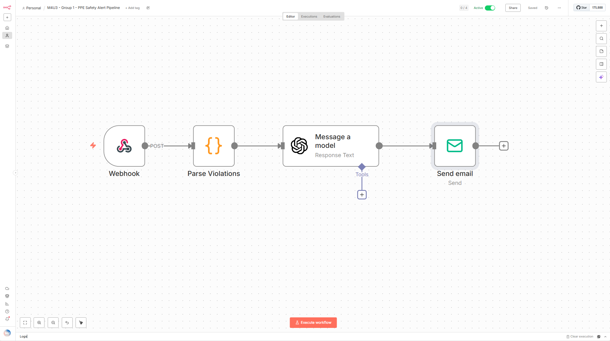
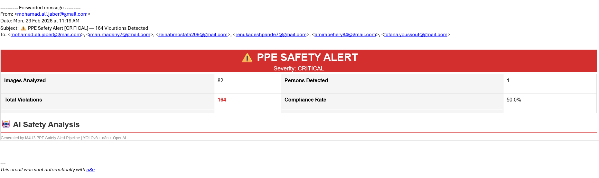

# M4U3 — Construction Site Safety Detection (YOLOv8)

## AECO problem framing
Construction sites require continuous monitoring of PPE compliance and safety-related hazards. Manual inspection is slow and inconsistent. This project trains a YOLOv8 object detection model to detect common construction safety objects and PPE violations in images.

## Success criteria
- Reproducible **cloud-only** workflow: a third party can open this repo in a browser and run the notebook in **Google Colab** (no local installs).
- Reports metrics (**Precision, Recall, mAP@50, mAP@50–95**) and exports curves/confusion matrices.
- Evidence pack includes:
  - 3–5 annotation examples
  - validation predictions (~48 images via batch collages)
  - +5 new/unseen-image prediction examples
- Includes short error analysis and governance/licensing notes.

---

## Dataset
Kaggle (Roboflow export):  
https://www.kaggle.com/datasets/snehilsanyal/construction-site-safety-image-dataset-roboflow

**Format:** YOLO (images + labels) with train/valid/test splits.

**Split used (dataset-provided):**
- Train: 2605 images
- Val: 114 images
- Test: 82 images

> Note: The dataset export includes train/valid/test splits (not a strict 80/20-only split). This repo uses the dataset-provided splits and reports metrics on validation and on the held-out test set.

---

## Classes (10)
0. Hardhat  
1. Mask  
2. NO-Hardhat  
3. NO-Mask  
4. NO-Safety Vest  
5. Person  
6. Safety Cone  
7. Safety Vest  
8. machinery  
9. vehicle  

Label rules and definitions: `docs/class_definitions.md`

---

# 📊 Final Results Summary

## 🟢 Train Split
- Precision: 0.874
- Recall: 0.712
- mAP@50: 0.827
- mAP@50–95: 0.622

## 🔵 Validation Split
- Precision: 0.865
- Recall: 0.683
- mAP@50: 0.793
- mAP@50–95: 0.490

## 🔴 Test Split (Unseen Data)
- Precision: 0.847
- Recall: 0.637
- mAP@50: 0.759
- mAP@50–95: 0.466

**Key takeaways (2–3):**
- Stronger performance on large/clear objects (Person, Hardhat, Safety Vest, machinery) than on small/ambiguous PPE signals (Mask/NO-Mask).
- Violation classes (`NO-*`) are harder because “absence of PPE” is ambiguous when the relevant body region is occluded or low-resolution.
- Some confusion occurs between `vehicle` and `machinery` due to visual similarity across construction equipment.

Curves + confusion matrices: `results/curves/`  
Evidence pack: `results/evidence/`

---

## How to reproduce (Colab steps — copy/paste)

### 1) Open notebook in Colab
Open this notebook from the repo in Google Colab:
- `notebooks/M4U3_Train_yolov8.ipynb`

### 2) Run all cells
In Colab:
- Runtime → **Restart runtime**
- Runtime → **Run all**

Expected outputs:
- Training run outputs (or loading trained weights if training is skipped)
- Saved curves and confusion matrices
- Inference outputs on the test/unseen split saved as annotated images
- Quantitative evaluation on the held-out test split

---

## Reproducibility Checklist (final run)
- Dataset link: Kaggle — Construction Site Safety Image Dataset (Roboflow)  
  https://www.kaggle.com/datasets/snehilsanyal/construction-site-safety-image-dataset-roboflow
- Dataset version: Kaggle snapshot (downloaded on 2026-02-13)
- Train/Val/Test split: Train=2605, Val=114, Test=82 images
- Model variant: YOLOv8n (yolov8n.pt)
- Epochs: 30
- Image size (imgsz): 640
- Batch size: 16
- Ultralytics version: 8.4.14
- Runtime used: Google Colab (GPU — Tesla T4)

---

## Reproducibility proof note (required)
- Last successful run: 2026-02-13 (Colab)
- Hardware: Tesla T4 GPU
- Expected runtime: ~20–30 minutes total (dataset extraction + 30-epoch training + evaluation), depending on Colab load

---

## Repo structure
- `notebooks/` — training + evaluation notebook (Colab-ready)
- `docs/` — class definitions, error analysis, governance checklist
- `results/` — curves and prediction evidence
- `weights/` — trained weights (`best.pt`, `last.pt`)

---

## Evidence locations (rubric mapping)
- Curves + confusion matrices: `results/curves/`
- Annotation examples (3–5 screenshots): `results/evidence/annotations/`
- New/unseen images predictions (5 screenshots): `results/evidence/new_images/`

### Validation predictions (rubric: 10)
Validation predictions are provided as **3 YOLO batch-collage screenshots**:
- `results/evidence/val_predictions/val_batch0_pred.jpg`
- `results/evidence/val_predictions/val_batch1_pred.jpg`
- `results/evidence/val_predictions/val_batch2_pred.jpg`

Each batch image is a collage containing **~16 validation images**, so the repo includes **~48 validation prediction examples total** (exceeding the “10 validation predictions” requirement).

---

## 🔄 Automated Safety Alert Pipeline (n8n + OpenAI)

Beyond model training and evaluation, this project includes a **production-ready deployment extension** that transforms detection results into actionable safety alerts using workflow automation and AI-powered reporting.

### Architecture
Google Colab (YOLOv8 Inference)
→ n8n Webhook (receives detection JSON)
→ Code Node (parse violations, compute compliance rate)
→ OpenAI GPT-4o-mini (generate safety analysis report)
→ SMTP Email (formatted alert to safety manager)

### How It Works

1. **Inference** — The notebook (`notebooks/03_n8n_Safety_Alert.ipynb`) loads the trained `best.pt` model and runs inference on the 82 test images
2. **Detection Parsing** — Results are packaged as JSON with per-class counts and average confidence scores
3. **Webhook Trigger** — The JSON payload is sent to an active n8n workflow via webhook
4. **AI Analysis** — OpenAI GPT-4o-mini analyzes the violations and generates a professional safety report with executive summary, risk assessment, and recommended actions
5. **Email Delivery** — A formatted HTML email with violation statistics and the AI-generated report is sent to the safety manager

### Results (Test Set — 82 Images)

| Metric | Value |
|--------|-------|
| Images Analyzed | 82 |
| Total Violations | 164 |
| Compliance Rate | 50% |
| Alert Delivery Time | ~37 seconds end-to-end |

### Technology Stack

| Component | Technology |
|-----------|------------|
| Object Detection | YOLOv8n (Ultralytics) |
| Workflow Automation | n8n (cloud-hosted) |
| AI Report Generation | OpenAI GPT-4o-mini |
| Email Delivery | SMTP (Gmail) |
| Runtime | Google Colab (T4 GPU) |

### Pipeline Evidence

**n8n Workflow:**

**Safety Alert Email Received:**

### How to Run

1. Open `notebooks/Group1_n8n_Safety_Alert.ipynb` in Google Colab
2. Upload `best.pt` (from `/weights/`) to the Colab session
3. Set runtime to **GPU (T4)**
4. Run all cells — the pipeline will automatically trigger the n8n workflow and deliver the safety alert email

> **Note:** The n8n webhook must be active for the email alert to be dispatched. The notebook includes error handling for cases where the webhook is unreachable.

### Future Deployment — Fully Automated Operation

The current pipeline runs on-demand from Google Colab. In a production environment, this system can be made fully autonomous:

| Deployment Mode | How It Works | Use Case |
|----------------|--------------|----------|
| Scheduled Colab | Google Colab scheduler triggers the notebook daily at 7:00 AM | Daily site compliance report |
| n8n Schedule Trigger | Replace webhook with n8n's built-in Schedule node — runs every hour automatically | Periodic batch monitoring |
| Edge Deployment | Site CCTV cameras → Edge device (Jetson Nano/iPad) runs YOLOv8n → sends detections to n8n webhook every 10 minutes | Real-time site monitoring |

The n8n webhook is already production-ready — any device or script that sends a POST request with detection JSON will trigger the full AI analysis and email alert pipeline. This means the system can scale from a single Colab notebook to hundreds of cameras across multiple construction sites without changing the n8n workflow.

---

## Docs
- Class definitions: `docs/class_definitions.md`
- Error analysis: `docs/error_analysis.md`
- Governance checklist: `docs/governance_checklist.md`

---

## Governance + licensing
- Governance checklist: `docs/governance_checklist.md`
- Repository license: MIT
- Dataset rights/terms: dataset is sourced from Kaggle and is subject to Kaggle/dataset terms and licensing.

